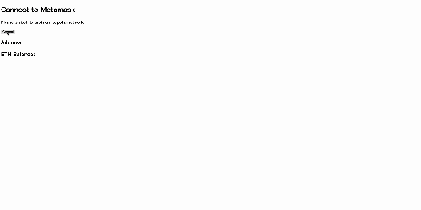

## NFT whitelist

**NFT whitelist showcases two methods for granting whitelists to users in the context of NFTs. It also utilizes secure random number generators provided by ChainLink VRF to mint NFTs randomly.**

- [Website Link]()  
- [NFT Backend code]()  
- This NFT is deployed on [Arbitrum Sepolia testnet](https://sepolia.arbiscan.io/address/0xb0F7A2bF92fC59D20890C01Bc2FCfAe7FD02BeD6).  

## Main Features

- **Efficient Gas Usage**: Save whitelists in a Merkle tree to reduce gas costs.
- **Flexible Whitelist Issuance**: Issue whitelists to users with EIP-191 signatures.
- **Tamper-Proof RNG**: Utilize ChainLink VRF to prevent manipulation of the random number generator by hackers.

## Smart contract Technique
- Merkle tree
- EIP-191 signature
- ChainLink VRF
- ERC721

## Backend Technique
- Ethers.js
- Express.js
- Openzeppelin/merkle-tree

## Demo
- Mint by signature

- Mint by proof (Merkle tree)

## How to start my project
- Claim ETH and $Link from [Alchemy](https://www.alchemy.com/faucets/arbitrum-sepolia) and [Chainlink](https://faucets.chain.link/arbitrum-sepolia).
- Fill in .env (private key, arbitrum sepolia rpc url, etherscan api key).
- Run [generate_merkle_tree.js]() to calculate a root.
- Create [VRF2.5 subscription](https://vrf.chain.link/arbitrum-sepolia/) and get subscription id.
- Change parameters of constructor in script/NFT.s.sol.
- Install foundry.
- Run: forge script script/NFT.s.sol:NFTScript --rpc-url $SEPOLIA_RPC_URL --broadcast --verify -vvvv
- Add the consumer (address of the NFT just deployed) to [your subscription](https://vrf.chain.link/arbitrum-sepolia/).
